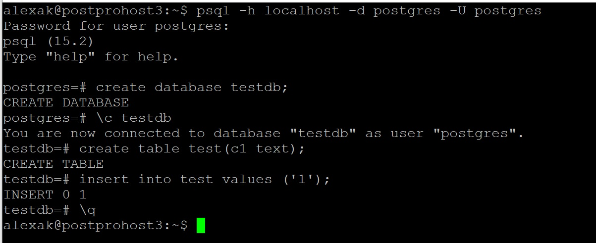

## Установка Postgres
>Устанолен Ubuntu версии 22.10 и PostgresPro версии 15.х на postprohost3 (Hyper-V VM)

>Создана тестовая база и в ней таблица.

>PostgresPro остановлен

>К виртуальной мошине подключен еще один диск.

>sdb - это подключенный диск

***sudo parted -l | grep Error***\
Error: /dev/sdb: unrecognised disk label

>Судя по этому выводу srb это как раз то, что нам надо.

>Устанавливает на нем GPT раздел. Размер диска небольшой можно было бы и MBR, но GPT это более современно и имеет больше возможнойстей

***sudo parted /dev/sdb mklabel gpt***

>Создает первичный раздел занимающий весь диск и имеющий файловую систему EXT4

***sudo parted -a opt /dev/sdb mkpart primary ext4 0% 100%***

>Создает файловую систему

***sudo mkfs.ext4 -L disk01/dev/sdb1***

>Нам необходим GUID раздела для постоянного подключения и монтирования диска. Нужный GUID помечен красным.

>Создаем точку монтирования для диска.

***sudo mkdir -p /mnt/disk01***

>Открываем файл /etc/fstab 

***sudo nano /etc/fstab***

>И добавляем туда строку. GUID мы взяли из команды lsblk

***/dev/disk/by-uuid/54d30f9d-b0e5-4ea5-b95e-aec41685be66 /mnt/disk01 ext4 defaults 0 1***

>Монтируем диск и рестартуем демон.

***sudo mount -a***

***sudo systemctl daemon-reload***

>Убедимся, что все нормалльно.

>Диск у нас примонтирован как /mnt/disk01. Все нормально.

>Поскольку удалять стремно, я скопировал все данные на новый диск.

***sudo  cp -R /var/lib/pgpro/std-15/data/ /mnt/disk01/data***

>Сделал собственником пользователя postgres

***sudo chown -R postgres:postgres /mnt/disk01/data***

>Ищем файл 

***sudo nano /usr/lib/systemd/system/postgrespro-std-15.service***

>Нас интересует вот такая строка

>Идем по этому пути и правим путь к файлам. На всякий случай оставим прежний путь закоментированным

>Рестарт сервиса

***sudo systemctl restart postgrespro-std-15.service***

>Смотрим, где теперь данные.

***sudo systemctl status postgrespro-std-15.service***

>А вот они.

>Таблица на месте.

>Теперь вернуть назад конфигурацию, разморнтировать диск и проделать тоже самое на другой машине.
>>Можно, но лень. 
>>> :-)
 
>**Задание выполнено. Ура!!!**

