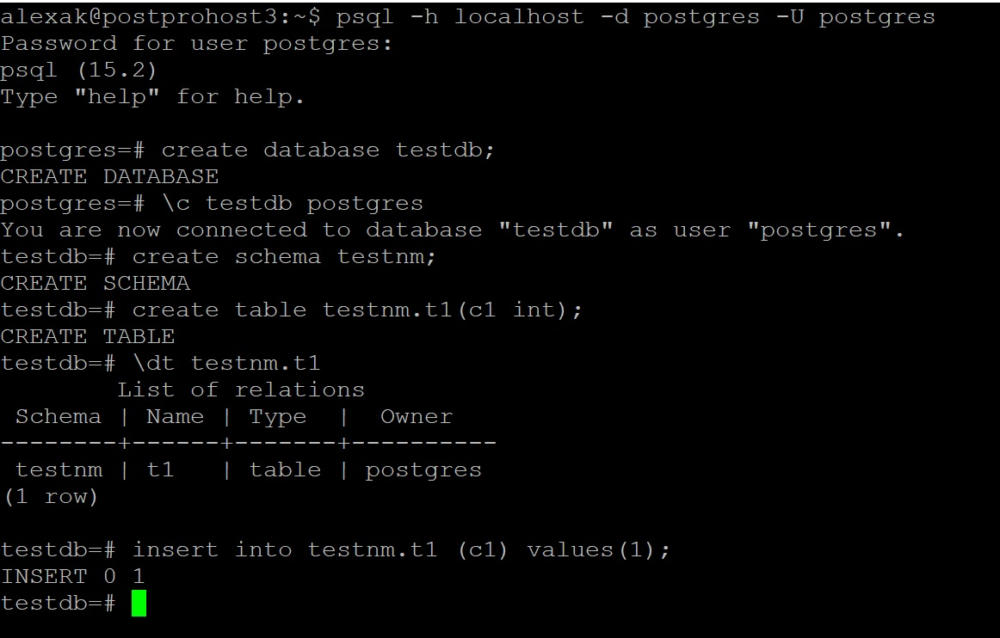
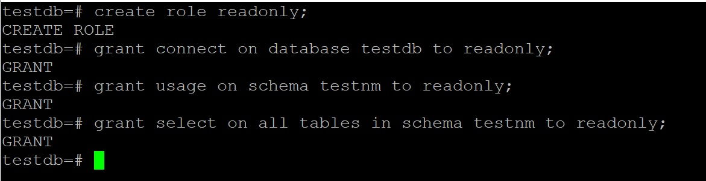
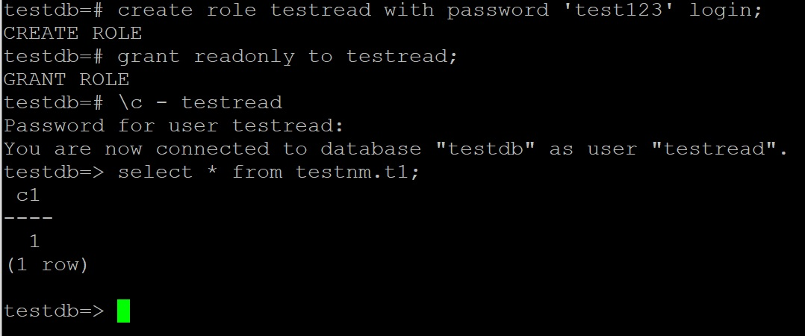
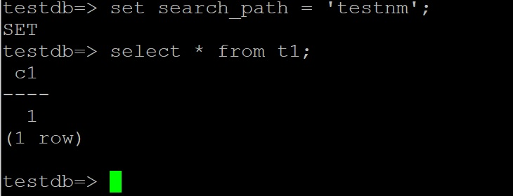
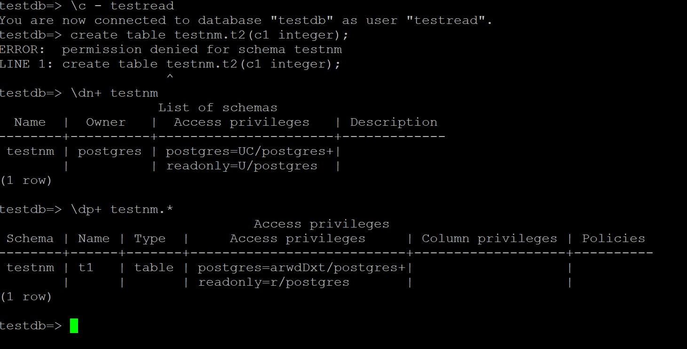

# Задание.
1. создайте новый кластер PostgresSQL 14
2. зайдите в созданный кластер под пользователем postgres
3. создайте новую базу данных testdb
4. зайдите в созданную базу данных под пользователем postgres
5. создайте новую схему testnm
6. создайте новую таблицу t1 с одной колонкой c1 типа integer
7. вставьте строку со значением c1=1

><u>Сделано пп 1-7</u>

8. создайте новую роль readonly
9. дайте новой роли право на подключение к базе данных testdb
10. дайте новой роли право на использование схемы testnm
11. дайте новой роли право на select для всех таблиц схемы testnm

><u>Сделано пп 8-11</u>

12. создайте пользователя testread с паролем test123
13. дайте роль readonly пользователю testread
14. зайдите под пользователем testread в базу данных testdb
15. сделайте select * from t1;
16. получилось? (могло если вы делали сами не по шпаргалке и не упустили один существенный момент про который позже)

><u>Сделано пп 12-16</u>

><u>У меня все получилось поскольку я сразу павильно создал таблицу в нужной схеме.</u>

30. как сделать так чтобы такое больше не повторялось? если нет идей - смотрите шпаргалку
><u>А вот так сделать. Теперь схему явно указывать не надо и при выполнии операций с объектом без схемы, операции будут перенаправляться на нужную схему</u>

34. теперь попробуйте выполнить команду create table t2(c1 integer); insert into t2 values (2);
35. а как так? нам же никто прав на создание таблиц и insert в них под ролью readonly?
36. есть идеи как убрать эти права? если нет - смотрите шпаргалку
37. если вы справились сами то расскажите что сделали и почему, если смотрели шпаргалку - объясните что сделали и почему выполнив указанные в ней команды
><u>Здесь какая-то ошибка в задании. Судя по разрешениям, приведенным ниже, роль ***testread*** не имет разрешений на создангие объектов. Она у меня их и не может создать.  Только роль ***postgres*** имеет разрешение ***UC*** на схему ***testnm*** и только она сможет создавать объекты в ней.</u>

><u>Задание выполнено, но получилось не все так ка было запланировано. Может проблема в том, что шпаргалок я не смотрел. Не люблю их со школы. :-)</u>