><u>Виртуальная машина под Hyper-V</u>

><u>4 процессора и 4 ГБ RAM</u>

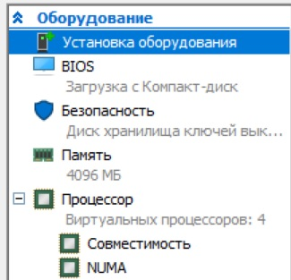

><u>Создаем папку и конфигупационный файл</u>

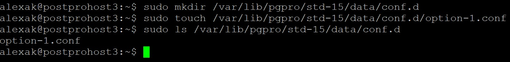

><u>Изменяем основной конфигурационный файл и указывает размещение дополнительного файла</u>

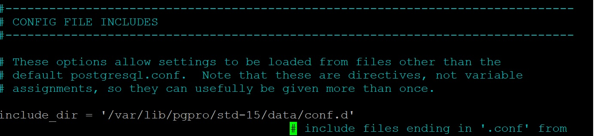

><u>Использовал утилиту от CYBERTEC для генерации настроек</u>

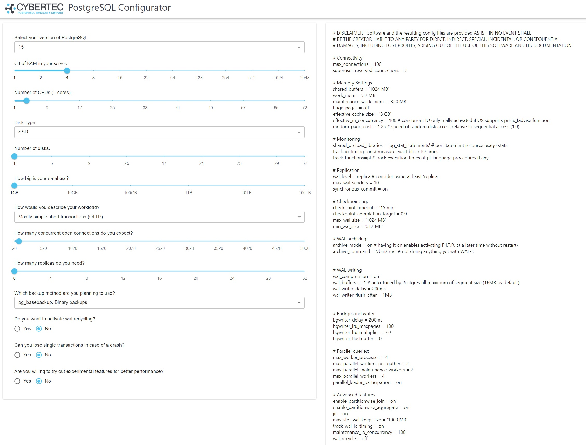

><u>Скопировал рекомендованные настройки в файл option-1.conf и рестартовал сервер.</u>

><u>Настроим тестирование. Загрузим поболее данных (1 000 000 строк) и установим внешние ключи для более реального пожхода</u>

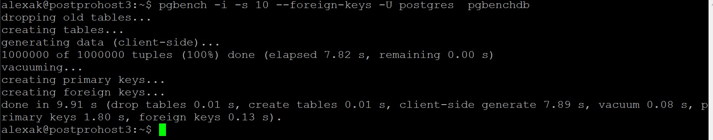

><u>Запустил тест</u>

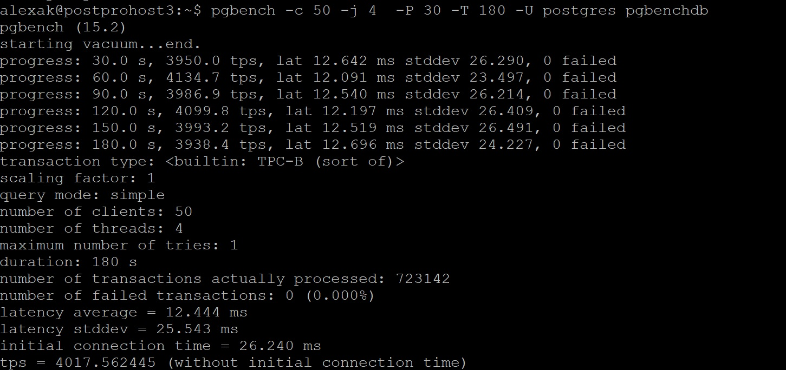

><u>Измели количество потоков до 16 и запустил тест еще раз</u>

><u>Результат получился хуже, поскольку процессоров 4, а потоков 16. Лишие потоки создают ненужное переключение процессора и производительность упала.</u>

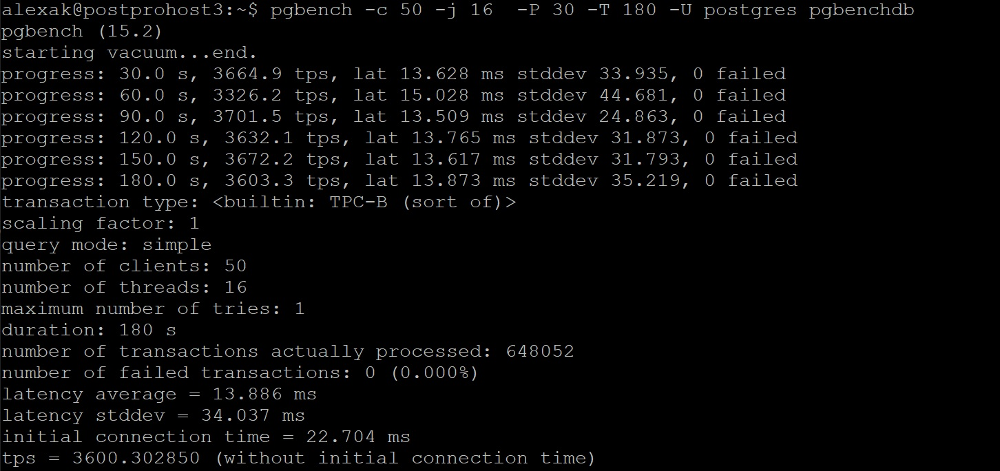

><u>Изменил настройки. Увеличил размер shared_buffers и уменьшил размер effective_cache_size</u>

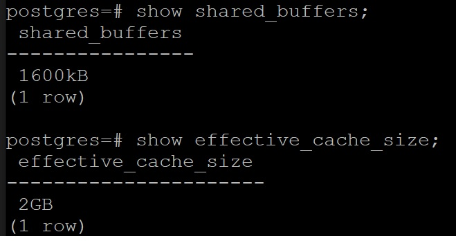

><u>Стало хуже было TPS 4017 стало 3816. Поскольку effective_cache_size это информация для оптимизатора, а не реальное выделение памяти. Оптимизатор начал строить не очень оптимальные планы.</u>

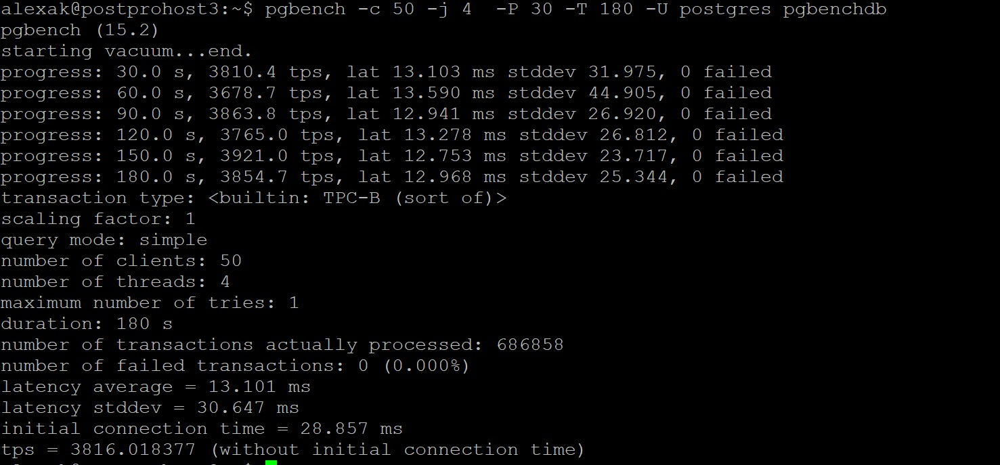

><u>Изменил work_mem до 256 КБ.</u>

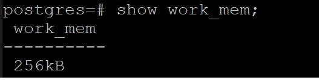

><u>Запустил тест. Стало ну очень плохо. Вывод надо увеличивть work_mem и итерационно проводить теститрование.</u>

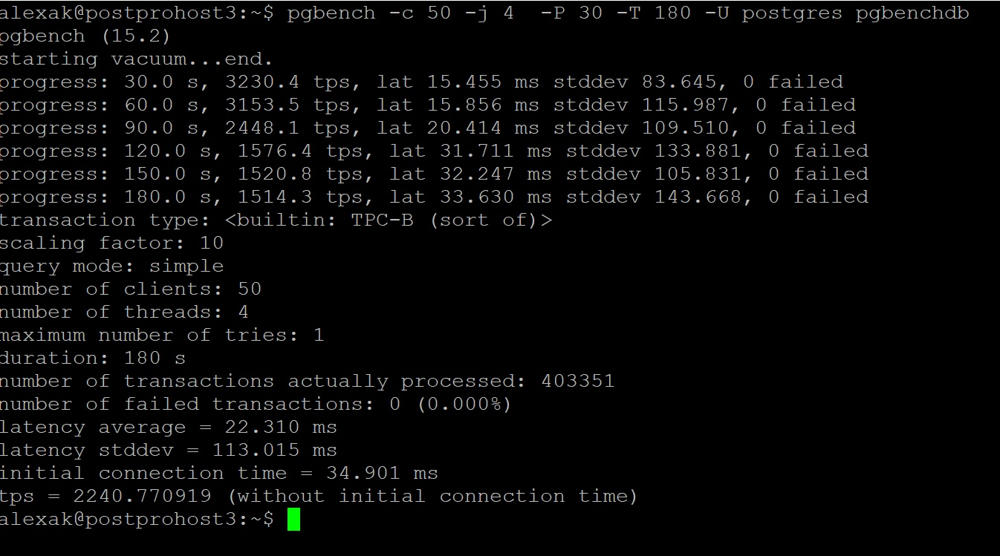

><u>ДЗ завершил.</u>