1. Создать инстанс ВМ с 2 ядрами и 4 Гб ОЗУ и SSD 10GB
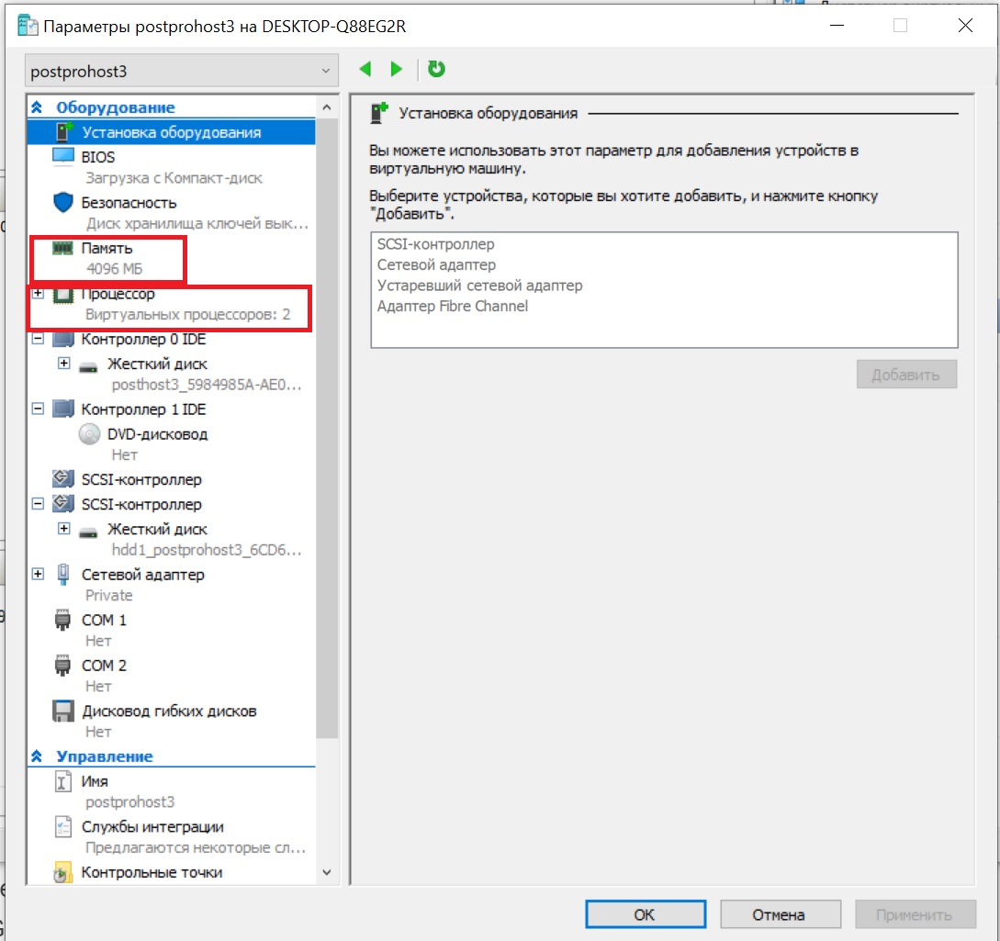
><u>Сделано пп 1</u>

2. Установить на него PostgreSQL 15 с дефолтными настройками
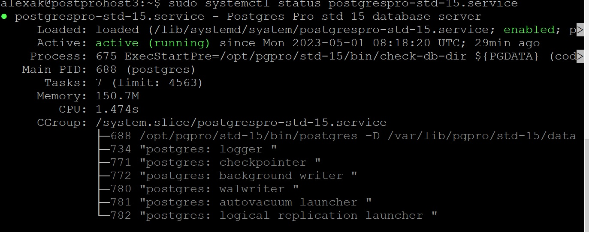
><u>Сделано пп 2</u>

3. Создать БД для тестов: выполнить 

***create database benchdb;***

***pgbench -i -h localhost -d benchdb -U postgres***
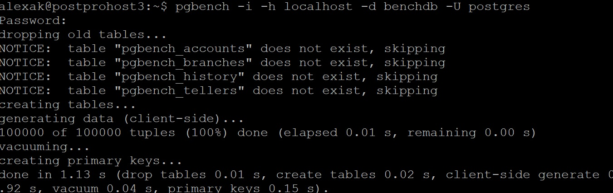
><u>Сделано пп 3</u>

4. Запустить pgbench -c8 -P 6 -T 60 -U postgres benchdb

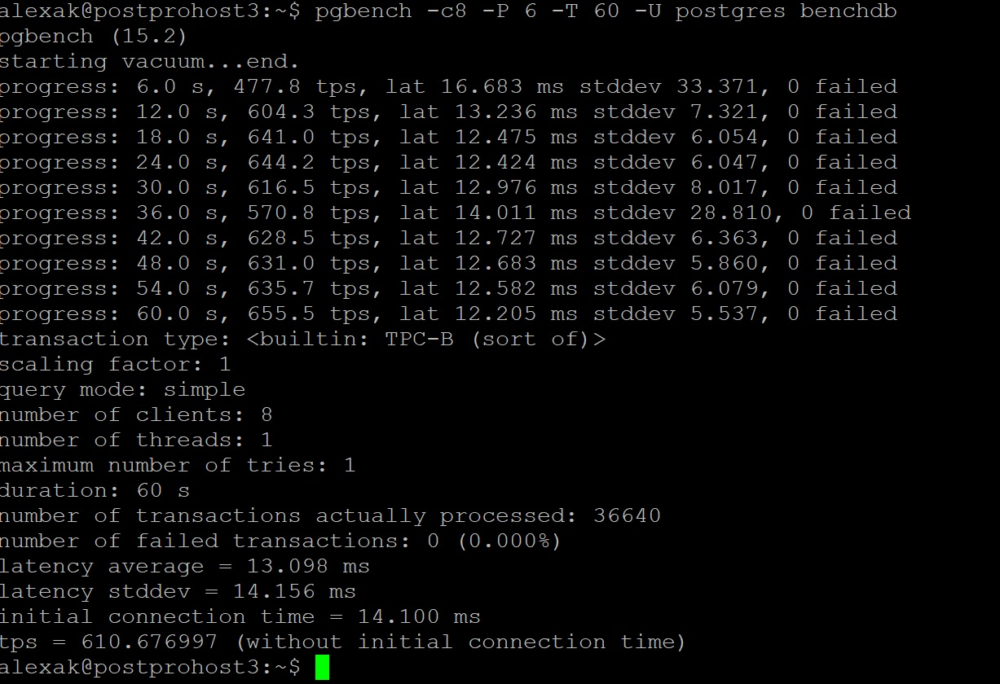
><u>Сделано пп 4</u>

5. Применить параметры настройки PostgreSQL из прикрепленного к материалам занятия файла

**DB Version: 11**
><u>У меня версия СУБД 15</u>

**OS Type: linux**

**DB Type: dw**

**Total Memory (RAM): 4 GB**

**CPUs num: 1**

**Data Storage: hdd**
><u>Сделать не могу. Дома ни одного HDD</u>

**max_connections = 40**

**shared_buffers = 1GB**

**effective_cache_size = 3GB**

**maintenance_work_mem = 512MB**

**checkpoint_completion_target = 0.9**

**wal_buffers = 16MB**

**default_statistics_target = 500**

**random_page_cost = 4**

**effective_io_concurrency = 2**

**work_mem = 6553kB**

**min_wal_size = 4GB**

**max_wal_size = 16GB**

6. Протестировать заново. Что изменилось и почему?

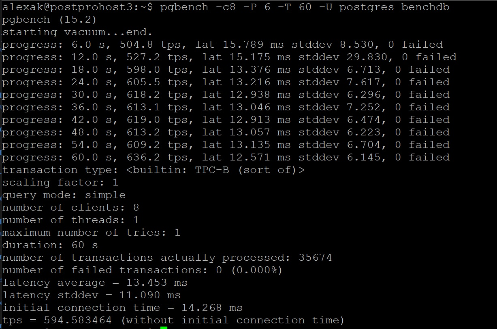
><u>Сделано пп 5. Да, собственно почти ничего не изменилось. Разве что TPS снизился чуть, но это не более 2%. Возможно проблема с тем, что у меня нет HDD</u>

7. Создать таблицу с текстовым полем и заполнить случайными или сгенерированными данным в размере 1 млн строк

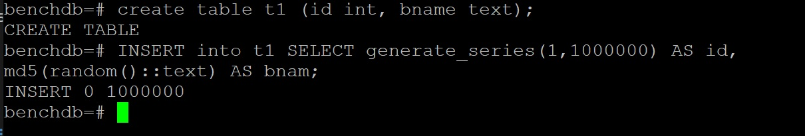
><u>Сделано пп 7.</u>

8. Посмотреть размер файла с таблицей

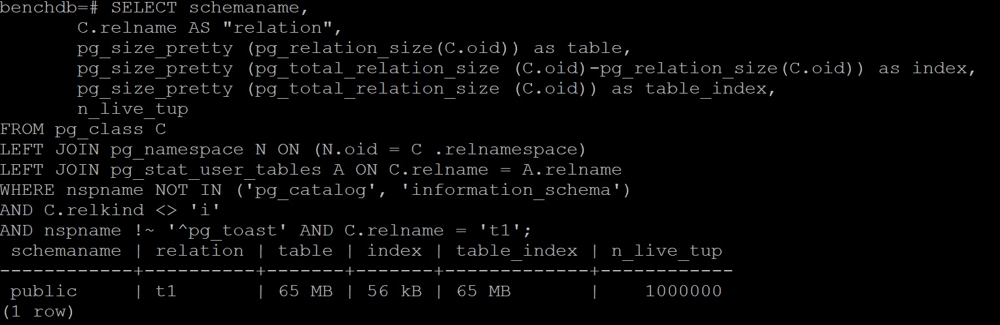
><u>Сделано пп 8.</u>

9. 5 раз обновить все строчки и добавить к каждой строчке любой символ
10. Посмотреть количество мертвых строчек в таблице и когда последний раз приходил автовакуум

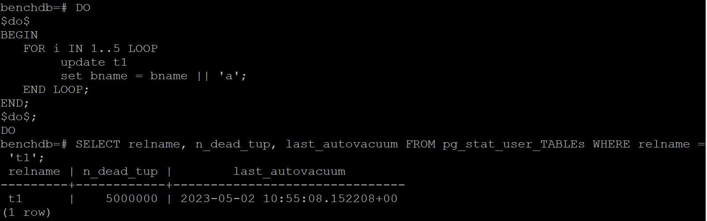
><u>Сделано пп 9-10.</u>

11. Подождать некоторое время, проверяя, пришел ли автовакуум

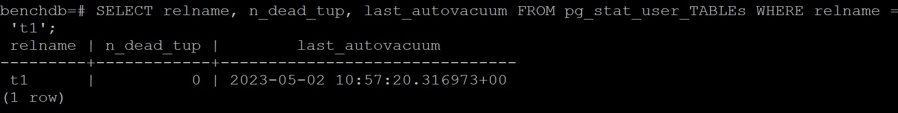
><u>Сделано пп 11. Да, прошел в 10:57:20. Мертвых строк нет. </u>

12. 5 раз обновить все строчки и добавить к каждой строчке любой символ
13. Посмотреть размер файла с таблицей

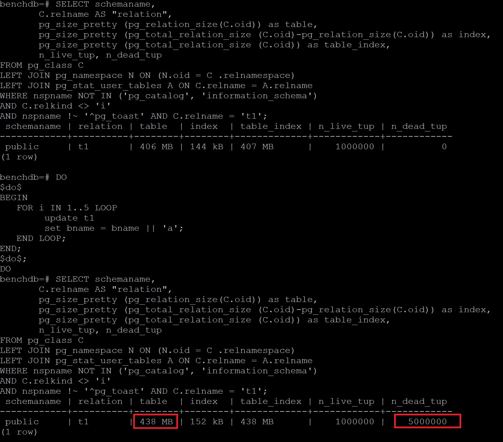
><u>Сделано пп 12-13.  Размер таблицы вырос на 32 МБ и в нем 5 млн мертвых строк </u>

14. Отключить Автовакуум на конкретной таблице
15. 10 раз обновить все строчки и добавить к каждой строчке любой символ
16. Посмотреть размер файла с таблицей
17. Объясните полученный результат

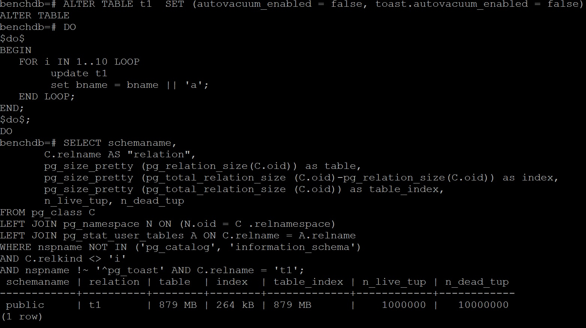
><u>Сделано пп 14-17.  Размер таблицы вырос до 879 МБ и в нем 10 млн мертвых строк </u>

18. Не забудьте включить автовакуум

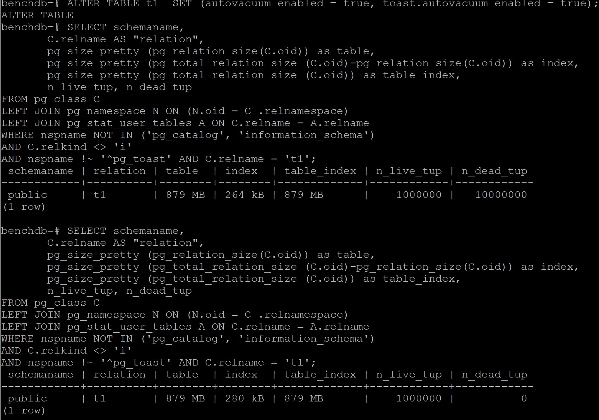
><u>Сделано пп . Хотя автовакуум отработал и удалил мертвые строки, но размер таблицы не уменьшился и составляет 879 МБ из-за наличия в ней дыр от удаленных строк</u>

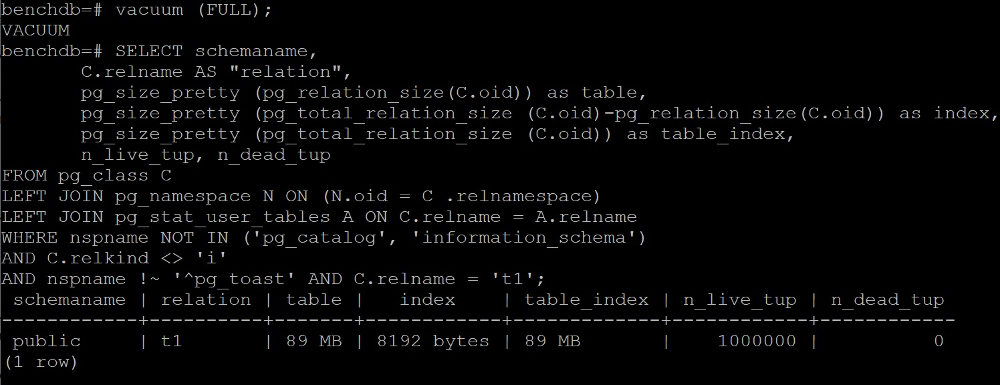
><u>VACUUM (FULL) отработал и уменьшил размер таблицы до 89 МБ</u>

